# Software Portfolio
Examples of my work

## Table of Contents
- <a href="#ssrs-reports">Microsoft SQL Server Reporting Services (SSRS)</a>
- <a href="#office-addins">Microsoft Office Addins (VSTO)</a>
- <a href="#visual-studio">Microsoft Visual Studio Projects</a>

 
 

<table style="width:100%">
<caption> 

### Microsoft SQL Server Reporting Services (SSRS)

</caption>
  <tr valign="top">
  <td>
<kbd> 
 

    Data Dictionary

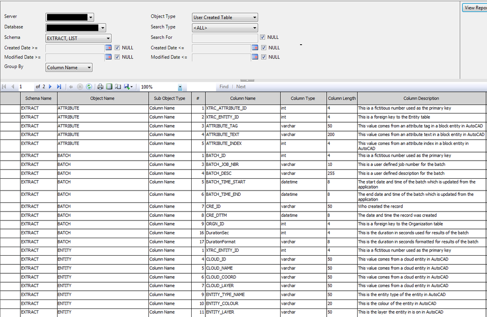
 
 

     
    This report is used for querying the 
     
    data dictionary of a SQL Server database.
    

</kbd>
  </td>
  <td>
<kbd> 
 

    Scheduled Jobs Gantt Chart

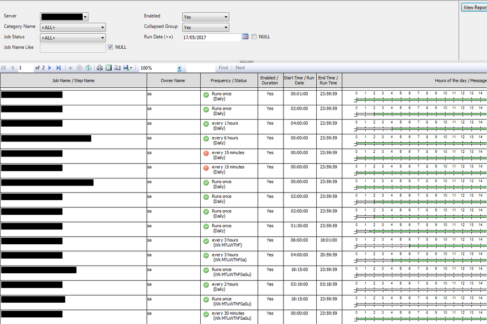
 

     
    This report is used for querying the 
     
    scheduled jobs for a SQL Server database.
    

</kbd>
  </td>
  <td>
<kbd> 
 

    S Curve Cumulative Progress

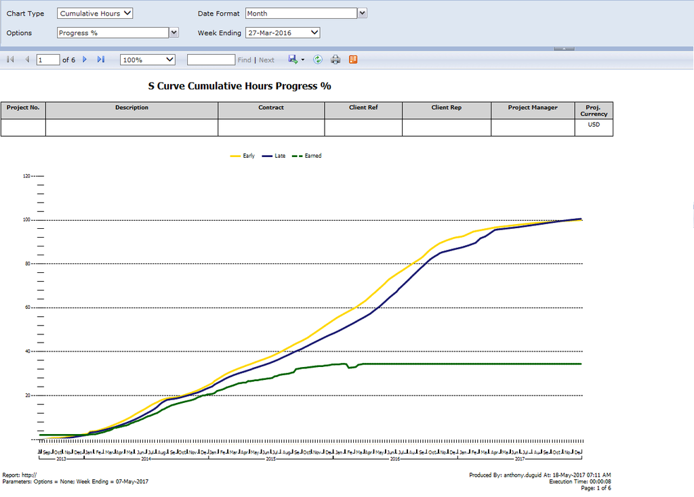
 

     
    This report is used for querying the 
     
    cumulative hours or sales quantities 
     
    plotted against time. It is dynamicly
     
    grouped by either quarter, month 
     
    or weekending.
    

</kbd>
  </td>
  </tr>
  <tr valign="top">
    <td>
<kbd> 
 

    Report Listing

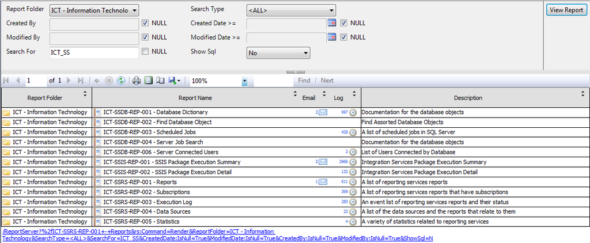
 

     
    This report is used for querying the 
     
    deployed SSRS reports, their subscriptions 
     
    and their execution logs. 
    

</kbd>
  </td>
      <td>
<kbd> 
 

    Report Subscriptions

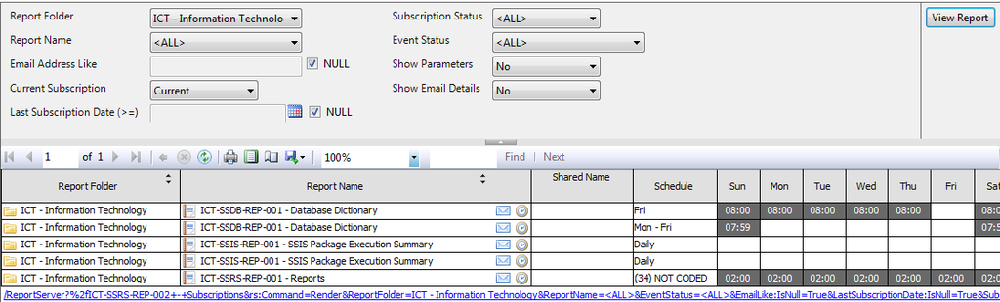
 

     
    This report is used for querying the 
     
    deployed SSRS subscriptions.
    

</kbd>
  </td>
  </tr>
</table>

 
 

<table style="width:100%">
<caption> 

### Microsoft Office Addins (VSTO)

</caption>
  <tr valign="top">
  <td>
<kbd> 
 

    Microsoft Excel Clouding Markup

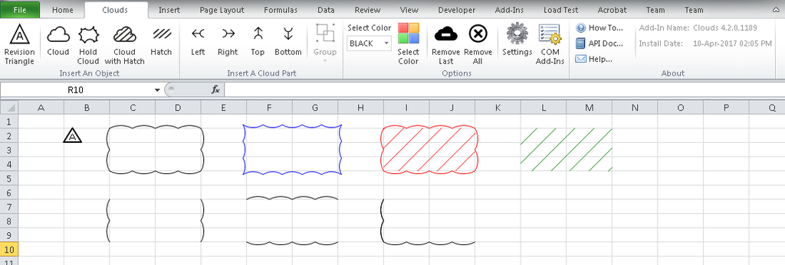
 
 

     
    Written in C#, it allows the user to mark 
     
    up files with revision clouding around 
     
    the selected cells in different colors.
    

</kbd>
  </td>
  <td>
<kbd> 
 

    Microsoft Excel Script Help

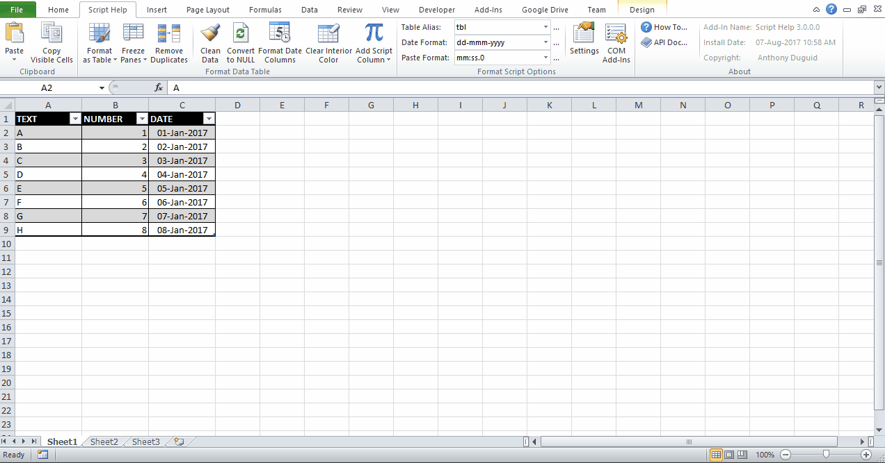
 

     
    Written in C#, it allows the user to use 
     
    a table to create different SQL scripts.
    

</kbd>
  </td>
  <td>
<kbd> 
 

    Microsoft Excel Server Actions

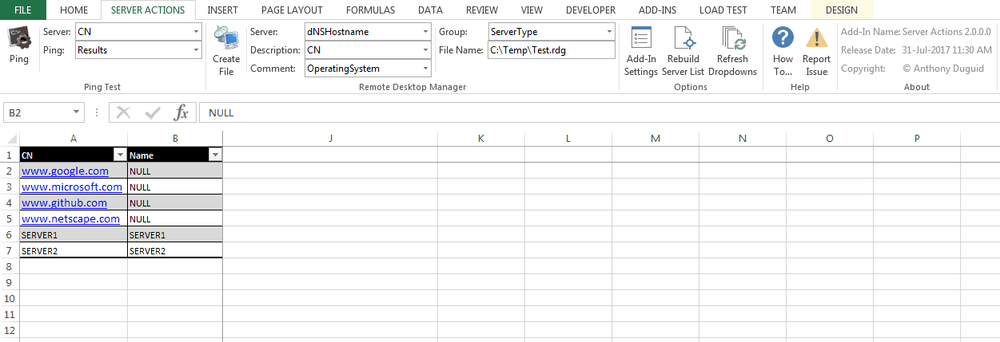
 

     
    Written in VBA to ping servers as well 
     
    as create a file for Microsoft Remote 
     
    Desktop Manager.
     
    or weekending.
    

</kbd>
  </td>
  </tr>

 
 

<table style="width:100%">
<caption> 

### Microsoft Visual Studio Projects

</caption>
  <tr valign="top">
  <td>
<kbd> 
 

    Active Directory Search

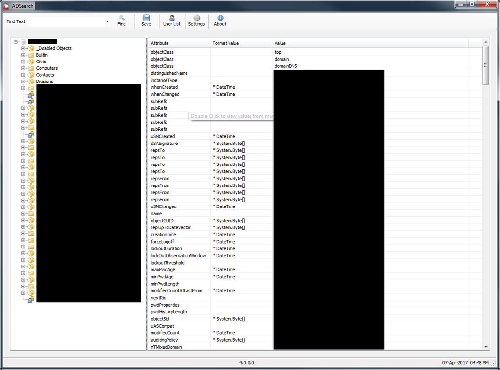
 
 

     
    Written in C#, it allows the user to  
     
    search Active Directory and save the 
     
    results to a .csv file
    

</kbd>
  </td>
  <td>
<kbd> 
 

    AutoCAD Automation Tool

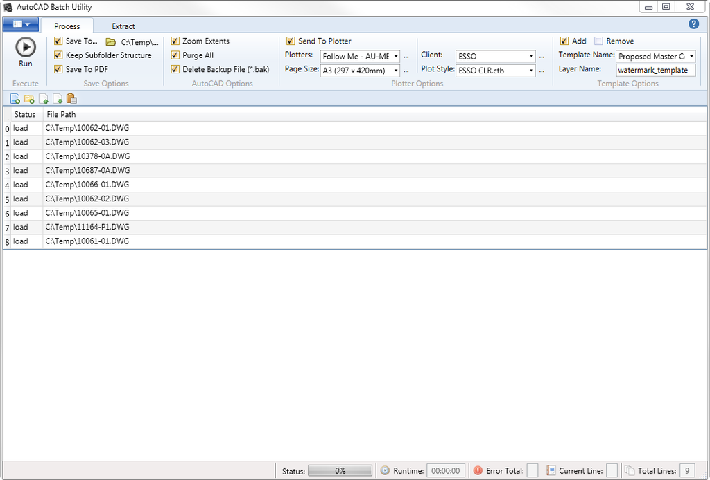
 

     
    Written in WPF/VB.NET, it allows the user 
     
    to batch plot AutoCAD files.
    

</kbd>
  </td>
  <td>
<kbd> 
 

    AutoCAD Automation Tool

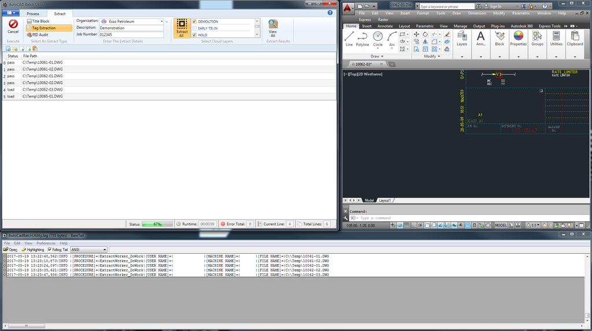
 

     
    Written in WPF/VB.NET, it allows the user 
     
    to export entity attributes from AutoCAD files.
    

</kbd>
  </td>
  </tr>
