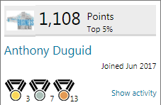

# Anthony Duguid
## Software Portfolio
On this page are examples of my work. If you'd like to speak to me about employment, please contact me through my <a href="https://www.linkedin.com/in/anthonyduguid/">LinkedIn</a> profile.

I am proficient with all phases of the system development life cycle (SDLC). Significant efforts include automating processes between applications, creating installations, creating help files and creating packaged software. Expertise in generating reports using SQL Server Reporting Services (SSRS) and Business Objects. I have built a synchronized Data Warehouse and multiple SSRS report solutions. Excellent knowledge in creating databases, tables, stored procedures, transactions, common table expressions, DDL/DML triggers, views, user defined data types, functions, cursors and indexes using T-SQL. Experience in performance tuning, query optimization and root cause analysis. Excellent analytical, communication and interpersonal skills. Proficient in technical writing and presentations and a good team player. Ability to work independently or as part of a team to accomplish critical business objectives and to make decisions under pressure. Efforts include utilizing a clean code approach to agile methodology.

 

<table style="width:100%">
    <caption>
        <h2>
            Table of Contents
        </h2>
    </caption>

<tr valign="top">
<td align="center" valign="middle">

</td>
<td align="left" valign="middle">
<a href="#ssrs-reports">SQL Server Reporting Services (SSRS)</a>
</td>
</tr>

<tr valign="top">
<td align="center" valign="middle">

</td>
<td align="left" valign="middle">
<a href="#visual-studio">Visual Studio Projects</a>
</td>
</tr>

<tr valign="top">
<td align="center" valign="middle">

</td>
<td align="left" valign="middle">
<a href="#office-addins">Office Projects</a>
</td>
</tr>

<tr valign="top">
<td align="center" valign="middle">

</td>
<td align="center" valign="middle">

</td>
</tr>
</table>

 
 
 
 
 
 
 
 

<html lang="en" xmlns="http://www.w3.org/1999/xhtml">

<table style="width:100%">
    <caption>
        <h2>
            
            SQL Server Reporting Services (SSRS)
        </h2>
    </caption>
    <tr valign="top">
        <td width="33%">
            <kbd>
                <a href="https://raw.githubusercontent.com/aduguid/SqlServerReportingServices/master/ServerDatabase/Database%20Dictionary.rdl">Data Dictionary</a>
                 
                 
                
                 
                 
                This report is used for querying the data dictionary of a SQL Server database.
                 
            </kbd>
        </td>
        <td width="33%">
            <kbd>
                <a href="https://raw.githubusercontent.com/aduguid/SqlServerReportingServices/master/ServerDatabase/Scheduled%20Jobs.rdl">Scheduled Jobs Gantt Chart</a>
                 
                 
                
                 
                 
                This report is used for querying the scheduled jobs for a SQL Server database.
                 
            </kbd>
        </td>
        <td width="33%">
            <kbd>
                <a href="https://github.com/aduguid/SqlServerReportingServices/blob/master/ServerDatabase/Activity%20Moniter.rdl">Activity Monitor</a>
                 
                 
                
                 
                 
                This report queries the activity monitor of a SQL Server.
                 
            </kbd>
        </td>
    </tr>
    <tr valign="top">
        <td width="33%">
            <kbd>
                <a href="https://raw.githubusercontent.com/aduguid/SqlServerReportingServices/master/ServerReports/Report%20List.rdl">Report Listing</a>
                 
                 
                
                 
                 
                This report is used for querying the deployed SSRS reports, their subscriptions and their execution logs.
                 
            </kbd>
        </td>
        <td width="33%">
            <kbd>
                <a href="https://raw.githubusercontent.com/aduguid/SqlServerReportingServices/master/ServerReports/Subscriptions.rdl">Report Subscriptions</a>
                 
                 
                
                 
                 
                This report is used for querying the deployed SSRS subscriptions.
                 
            </kbd>
        </td>
        <td width="33%">
            <kbd>
                <a href="https://github.com/aduguid/SqlServerReportingServices/blob/master/ServerReports/Execution%20Log.rdl">Execution Log</a>
                 
                 
                
                 
                 
                This report is used for querying the report server exection log table.
                 
            </kbd>
        </td>
    </tr>
    <tr valign="top">
        <td width="33%">
            <kbd>
                <a href="https://github.com/aduguid/SqlServerReportingServices/blob/master/ServerReports/Report%20Documentation.rdl">Report Documentation</a>
                 
                 
                
                 
                 
                This report is used for querying the deployed report XML.
                 
            </kbd>
        </td>
        <td width="33%">
            <kbd>
               <a href="https://github.com/aduguid/SqlServerReportingServices/blob/master/ServerReports/Data%20Sources.rdl">Report Data Sources</a>
                 
                 
                
                 
                 
                This report is used for querying the deployed data sources.
                 
            </kbd>
        </td>
        <td width="33%">
            <kbd>
                <a href="https://github.com/aduguid/SqlServerReportingServices/blob/master/ServerReports/Permissions.rdl">Report Server Folder Permissions</a>
                 
                 
                
                 
                 
                This report is used for querying the report server folder permissions.
                 
            </kbd>
        </td>
    </tr>
    <tr valign="top">
        <td width="33%">
            <kbd>
                S Curve Cumulative Progress
                 
                 
                
                 
                 
                This report is used for querying the cumulative hours or sales quantities plotted against time. It is dynamicly grouped by either quarter, month or weekending.
                 
            </kbd>
        </td>
        <td width="33%">
            <kbd>
                Weekly Calendar
                 
                 
                
                 
                 
                This report uses a nested tablix inside of a matrix to create a calendar view.
                 
            </kbd>
        </td>
        <td width="33%">
            <kbd>
                <a href="https://gist.githubusercontent.com/aduguid/4905cd812ef2c86ad3d026be852c62ad/raw/deff6b7cd79f2b729aa31e62795cfa32956cf4f3/SSRS.heatmap_example">Heat Map Calendar</a>
                 
                 
                
                 
                 
                This report is a heat map calendar of events. It uses a variable for the base color.
                 
            </kbd>
        </td>
    </tr>
</table>
 
 
 

<table style="width:100%">
    <caption>
        <h2>
            
            Visual Studio Projects
        </h2>
    </caption>
    <tr valign="top">
        <td width="33%">
            <kbd>
                <a href="https://github.com/aduguid/ActiveDirectorySearch/blob/master/README.md">Active Directory Search</a>
                 
                 
                
                 
                 
                Written in C#/Windows Forms, it allows the user to search Active Directory and save the results to a .csv file
                 
            </kbd>
        </td>
        <td width="33%">
            <kbd>
                AutoCAD Automation Tool (Plotting)
                 
                 
                
                 
                 
                Written in VB.NET/WPF, it allows the user to batch plot AutoCAD files.
                 
            </kbd>
        </td>
        <td width="33%">
            <kbd>
                AutoCAD Automation Tool (Extracting)
                 
                 
                
                 
                 
                Written in VB.NET/WPF, it allows the user to export entity attributes from AutoCAD files.
                 
            </kbd>
        </td>
    </tr>
    <tr valign="top">
        <td width="33%">
            <kbd>
                <a href="https://github.com/aduguid/DocumentumScriptAdministrator/blob/master/README.md">Documentum Script Administrator</a>
                 
                 
                
                 
                 
                Written in C#/WPF, it allows the user to run a file as one command against the idql32/64.
                 
            </kbd>
        </td>
        <td width="33%">
            <kbd>
                <a href="https://raw.githubusercontent.com/aduguid/SharePointWebparts/master/Timezones_with_Temp.dwp">SharePoint Webpart Timezones & Temperature</a>
                 
                 
                
                 
                 
                Written in HTML/Javascript, it displays timezones with hyperlinks to temperature. The time updates every second.
                 
            </kbd>
        </td>
        <td width="33%">
            <kbd>
                <a href="https://github.com/aduguid/SoftwarePortfolio/edit/master/README.md">Mark Up/Mark Down Example</a>
                 
                 
                
                 
                 
                Written in HTML, it displays this page.
                 
            </kbd>
        </td>
    </tr>
</table>
 
 
 

<table style="width:100%">
    <caption>
        <h2>
            
            Office Projects
        </h2>
    </caption>
    <tr valign="top">
        <td width="33%">
            <kbd>
                Microsoft Excel Clouding Markup (VSTO)
                 
                 
                
                 
                 
                Written in C#, it allows the user to mark up files with revision clouding around the selected cells in different colors.
                 
            </kbd>
        </td>
        <td width="33%">
            <kbd>
                <a href="https://github.com/aduguid/ScriptHelp/blob/master/README.md">Microsoft Excel Script Help (VSTO)</a>
                 
                 
                
                 
                 
                Written in C#, VB.NET and VBA, it allows the user to use a table to create different SQL scripts.
                 
            </kbd>
        </td>
        <td width="33%">
            <kbd>
                <a href="https://github.com/aduguid/MicrosoftExcelFavorites/blob/master/README.md">Microsoft Excel Favorites Ribbon (VSTO)</a>
                 
                 
                
                 
                 
                Written in VB.NET, it allows the user to create a custom Excel favorites ribbon.
                 
            </kbd>
        </td>
    <tr valign="top">
        <td width="33%">
            <kbd>
                <a href="https://github.com/aduguid/MicrosoftVisioShapeExtract/blob/master/README.md">Microsoft Visio Shape Export (VSTO)</a>
                 
                 
                
                 
                 
                Written in VB.NET, it allows the user to export the shape attributes to a .csv file.
                 
            </kbd>
        </td>
        <td width="33%">
            <kbd>
                Microsoft Visio Network Diagram Example
                 
                 
                
                 
                 
                An example of a network diagram. The header and footer reference the file properties.
                 
            </kbd>
        </td>
        <td width="33%">
            <kbd>
                <a href="https://github.com/aduguid/ServerActions/blob/master/README.md">Microsoft Excel Server Actions (VBA)</a>
                 
                 
                
                 
                 
                Written in VBA to ping servers as well as create a Microsoft Remote Desktop Manager file.
                 
            </kbd>
        </td>
    </tr>
        <tr valign="top">
        <td width="33%">
            <kbd>
                <a href="https://github.com/aduguid/MicrosoftAccessExamples/blob/master/README.md">Microsoft Access VBA Examples</a>
                 
                 
                
                 
                 
                Written in VBA, here are examples of reports and code for MS Access.
                 
            </kbd>
    </tr>
</table>
</html>
